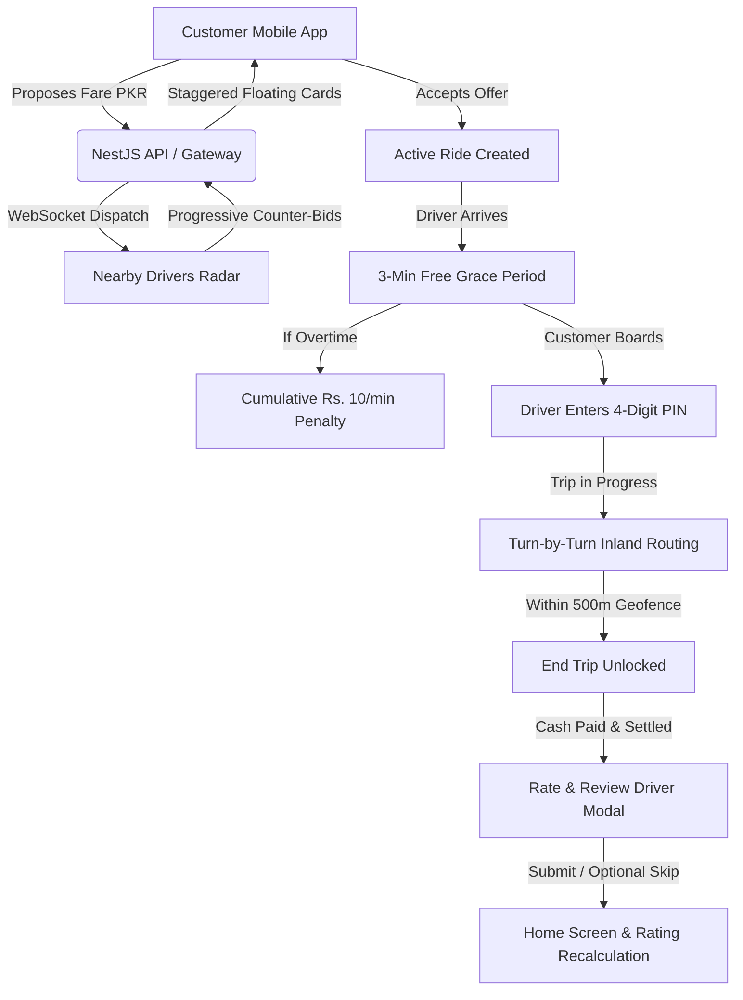

# 🇵🇰 Pakistan Super App (Unified Services Marketplace)

<div align="center">

-amber?style=for-the-badge&logo=git&logoColor=white)


<br />

**A hyper-localized, enterprise-grade multi-service platform custom-engineered for Pakistan's urban transit and emergency roadside ecosystem.**

[Architecture](#-architecture--monorepo-structure) • [Core Features](#-core-features--engineering-highlights) • [Quick Start](#-quick-start--development-guide) • [API & Ports](#-port-mapping--endpoints) • [Roadmap](#-roadmap--active-milestones)

</div>

---

> [!WARNING]
> ### 🚧 Active Work In Progress (WIP)
> This platform is under **active development**. While core ride-hailing, dynamic bargaining engines, anti-fraud geofencing, roadside assistance, and driver rating systems are fully functional and interactive, additional home-service categories, payment gateway integrations (Easypaisa / JazzCash / 1LINK RAAST), and production clustering are actively being expanded.
>
> Developer contributions, issue reports, and feedback are welcome!

---

## 📖 Executive Summary

The **Pakistan Super App** solves fragmented urban utility and transport challenges across major Pakistani metropolitan cities (Karachi, Lahore, Islamabad/Rawalpindi). Instead of maintaining separate apps for ride-hailing, mechanics, towing, and emergency help, this unified monorepo provides:

1. **inDrive-Style Ride Bargaining Engine**: Real-time bidding where passengers propose fares and drivers place progressive counter-bids with expiring timers.
2. **Anti-Fraud Security Architecture**:
   - **4-Digit Boarding PIN**: Prevents fraudulent trip starts; only the driver can confirm passenger boarding on their terminal.
   - **Dynamic Waiting Penalties**: Free 3-minute grace period upon arrival, followed by an automatic Rs. 10/min overtime penalty.
   - **Destination Geofencing**: Dropoff completion is locked until the driver is physically within 500m of the agreed coordinates.
3. **Driver Profiles & Verified Credentials**: Comprehensive profiles highlighting NADRA CNIC verification, Sindh Police driving license clearance, air conditioning guarantees, and community reviews.
4. **Post-Ride Community Reviews**: 5-star interactive rating with compliment badges and an optional 1-tap skip button.
5. **Roadside Assistance (RSA)**: On-demand dispatch for flat tires, dead battery jumpstarts, mechanical breakdowns, and heavy-duty flatbed towing.
6. **Dual-Role Switcher**: Instant transition between Customer Mode and Provider/Driver Console on the same client.
7. **Admin Operations Radar**: Live dispatch command center with fleet map tracking, pricing controls, and verification workbenches.

---

## 🏗️ Architecture & Monorepo Structure

Built on **Turborepo** with shared TypeScript types, validation packages, and map abstraction layers:

```
pakistan-super-app/
├── apps/
│   ├── mobile/              # React Native (Expo SDK 52) + Expo Router v4
│   │   ├── app/             # File-based routing ((customer), (provider), (auth))
│   │   ├── src/components/  # Interactive maps, driver profiles, rating modals
│   │   ├── src/store/       # Zustand persistent application state
│   │   └── src/theme/       # Emerald Green design system & typography tokens
│   │
│   └── admin-web/           # React + Vite Operations Command Center
│       ├── src/pages/       # Live Fleet Radar, Dispatch Feed, Provider KYC
│       └── src/components/  # Real-time metrics cards, map visualization
│
├── services/
│   └── api/                 # NestJS 11 + Prisma ORM + Socket.IO + Swagger
│       └── src/modules/     # Rides, Bargaining, Realtime Gateway, Admin
│
├── packages/
│   ├── types/               # Shared domain interfaces, enums, and DTOs
│   ├── validators/          # Zod schemas (Pakistani phone, CNIC format)
│   └── maps/                # Haversine distance, bearings, Pakistani landmarks
│
├── turbo.json               # Turbo build pipeline & caching configuration
├── package.json             # Root npm workspaces definition
└── .gitignore               # Clean artifact exclusions
```

### System Flow Diagram



---

## 🌟 Core Features & Engineering Highlights

### 🚗 1. inDrive-Style Dynamic Bargaining
- **Live Bid Broadcaster**: Passengers specify pickup and dropoff points across authentic Karachi coordinates (Dolmen Mall Clifton, Shahrah-e-Faisal, FTC Building, Saddar, Gulshan).
- **Staggered Vertical Floating Cards**: Driver bids pop up with independent 15-second countdown timers, animating smoothly from top to bottom.
- **Decline & Resend**: Declining a bid allows the driver to reconsider and send an updated counter-offer at a more competitive price.
- **Pre-Acceptance Profile Inspection**: Tapping any driver's card opens their full verified profile, vehicle details, and passenger review history before accepting.

### 🛡️ 2. Anti-Fraud Driver Terminal & Geofencing
- **Customer PIN Boarding Verification**: Customers receive a private 4-digit code (`5821`). The driver must enter this code on the Driver App Terminal to prevent ghost trips or premature fare start.
- **Dynamic Overtime Waiting Penalty**:
  - Drivers are given a free 3-minute waiting timer upon arrival.
  - If the passenger delays, an automated penalty of **Rs. 10 per minute** is calculated in real time and itemized on the final cash bill.
- **500m Geofence Lock**: Prevents drivers from completing trips prematurely. The `Arrive at Destination & Complete Trip` action is locked until the vehicle enters the 500m dropoff zone.
- **Clean Customer View**: The visual geofence circle is isolated to the driver's interface, keeping the passenger map clutter-free.

### ⭐ 3. Driver Profile & Community Review System
- **Official Credentials & Badges**: Displays **CNIC Verified** (NADRA database check), **Driving License Verified** (Sindh Police DL), and safety commendations.
- **Registered Vehicle Specifications**: Make, model, manufacturing year, license plate badge (`KHI-9821`, `KHI-5541`, `KHI-3209`), and **❄️ Chilled AC Verified** guarantee.
- **Post-Ride Rating Modal**:
  - Interactive 5-star rating selector with mood feedback.
  - Quick compliment chips (*Ice Cold AC*, *Clean Car*, *Safe Driving*, *Polite Driver*, *On-Time Pickup*).
  - Multiline review text input for passenger comments.
  - **100% Optional Skip**: Prominent "Skip for Now" button allows passengers to bypass the review instantly.
  - **Dynamic Recalculation**: Submitting a review recalculates the driver's weighted average rating across all screens in real time:
    $$\text{newRatingAverage} = \frac{(\text{currentRating} \times \text{totalRatings}) + \text{newRating}}{\text{totalRatings} + 1}$$

### 🔧 4. Roadside Auto Assistance (RSA)
- Direct on-demand roadside dispatch for:
  - 🔋 **Dead Battery Jumpstart**
  - 🛞 **Flat Tire Replacement**
  - 🌡️ **Engine Overheating & Radiator Coolant**
  - 🏗️ **Flatbed Towing Truck Dispatch**
  - 🔑 **Key Lockout Assistance**

### 🔄 5. Instant Dual-Role Switcher
- Switch seamlessly between **Customer Mode** and **Provider Mode** with a single toggle.
- Providers can view daily PKR earnings, acceptance rates (94%), online/offline radar feeds, and job acceptance controls.

---

## 🚀 Quick Start & Development Guide

### 1. Prerequisites
- **Node.js**: `v20.x` or `v22.x+` (LTS recommended)
- **npm**: `v10.x+`
- **Git**: Installed and configured

### 2. Clone & Install Dependencies
```bash
# Clone the repository
git clone https://github.com/HunainxAhmed/Pakistan-Super-App.git

# Navigate to project root
cd Pakistan-Super-App

# Install all workspace dependencies
npm install

# Build shared types, validators, and map packages
npx turbo run build
```

---

## 🖥️ Running Services Locally

You can launch all services independently or together:

### Option A: Run Backend API Service (`services/api`)
```bash
npm --workspace=services/api run start:dev
# or from compiled dist:
node services/api/dist/main.js
```
- **REST API**: `http://localhost:4000/api/v1`
- **Interactive Swagger Docs**: `http://localhost:4000/api/docs`

### Option B: Run Mobile Application (`apps/mobile`)
```bash
npm --workspace=apps/mobile run start
# For web browser preview directly:
npx expo start --lan --port 8081 --web
```
- **Web App Interface**: `http://localhost:8081`
- **Physical Device**: Scan the QR code using the **Expo Go** app (iOS / Android).

### Option C: Run Admin Web Dashboard (`apps/admin-web`)
```bash
npm --workspace=apps/admin-web run dev
```
- **Admin Dashboard**: `http://localhost:3000`

---

## 🌐 Port Mapping & Endpoints

| Service | Port | Technology | URL | Description |
|---|---|---|---|---|
| **Mobile App (Expo)** | `8081` | React Native / Expo Router | `http://localhost:8081` | Customer & Driver client interface |
| **Backend API** | `4000` | NestJS 11 / Express | `http://localhost:4000/api/v1` | Core business logic, pricing & dispatch |
| **Swagger API Docs** | `4000` | OpenAPI 3.0 / Swagger | `http://localhost:4000/api/docs` | Interactive REST documentation |
| **Admin Command Center** | `3000` | React / Vite | `http://localhost:3000` | Fleet radar & verification workbench |

---

## 🧪 Testing & Verification

```bash
# Verify TypeScript compile-time safety across packages
npm --workspace=packages/types run build
npm --workspace=apps/mobile run typecheck

# Run backend unit tests
npm --workspace=services/api run test
```

---

## 🗺️ Roadmap & Active Milestones

- [x] Monorepo setup with Turborepo and shared TypeScript packages
- [x] inDrive-style dynamic bargaining engine with staggered bidding cards
- [x] Anti-fraud 4-digit boarding PIN verification
- [x] Overtime waiting penalty system (3-min grace + cumulative charges)
- [x] Dropoff destination geofence lock (500m radius threshold)
- [x] Driver profiles with verified credentials (CNIC, License, AC guarantee)
- [x] Post-ride 5-star rating & review system with optional skip
- [x] Roadside auto assistance and mechanic dispatch
- [ ] Integration with Pakistani FinTech Gateways (JazzCash, Easypaisa, RAAST 1LINK)
- [ ] Push notifications via Firebase Cloud Messaging (FCM)
- [ ] Multi-city expansion (Lahore Ring Road, Islamabad Expressway)
- [ ] Urdu & regional language voice-assisted booking for drivers

---

## 👤 Author & Maintainer

**Hunain Ahmed**
- GitHub: [@HunainxAhmed](https://github.com/HunainxAhmed)
- Email: `hunainahmed984@gmail.com`

---

## 📄 License

This project is licensed under the [MIT License](LICENSE).
